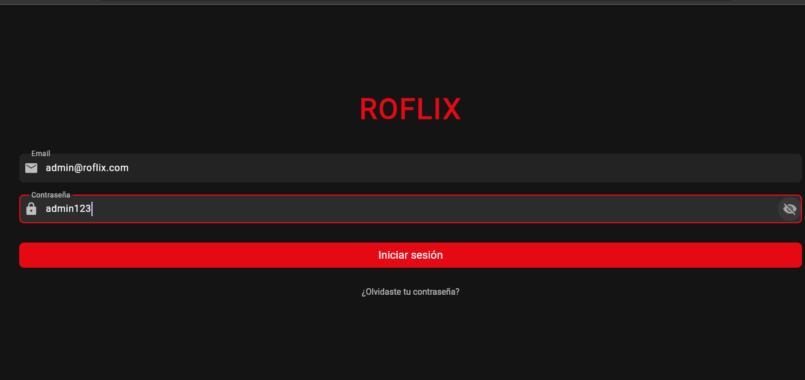
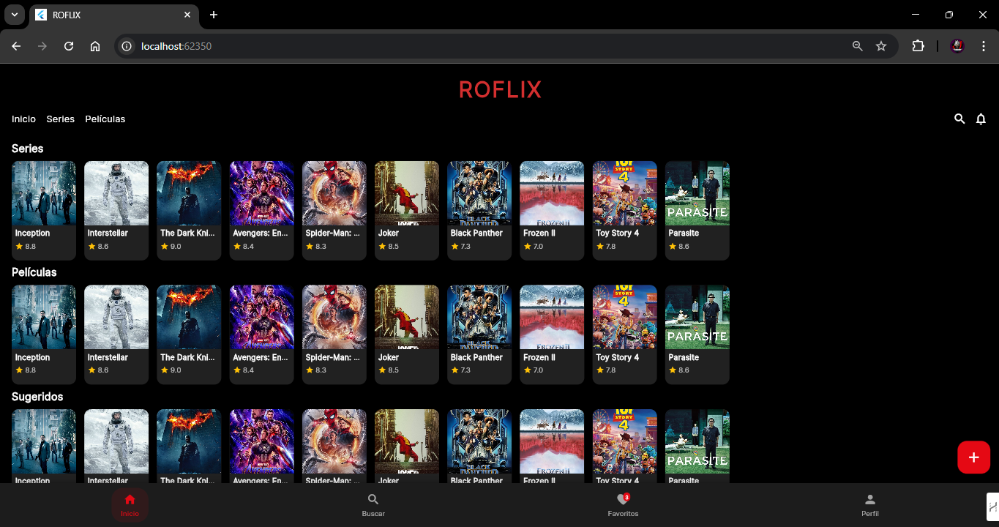
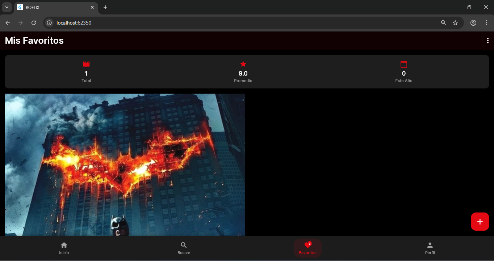

LOGIN DE LA APLICACION 

INICIO DE LA APLICACION

SELECCION DE PELICULA 

SURGERENCIAS SIMILARES DE LA PELÑICULA

BUSCAR PELICULAS

BUSCANDO PELICULAS (COMO HARRY POTTER)

PARTE DE PELICULAS FAVCORITAS

MI PERFIL DE ADMININ
 
AGREGAR NUEVA PELICULA


# 🎬 ROFLIX - Aplicación de Películas

Una aplicación moderna de películas construida con Flutter que permite a los usuarios descubrir, buscar y gestionar sus películas favoritas.

## ¿Qué es ROFLIX?

ROFLIX es una aplicación demo tipo Netflix desarrollada en Flutter. Permite a los usuarios explorar un catálogo de películas, ver detalles, trailers y gestionar una lista de favoritos, todo con una experiencia visual moderna y responsiva.

### ¿Cómo funciona?
- El usuario inicia sesión con un usuario demo.
- En la pantalla principal (Home) se muestran 10 películas demo en carouseles.
- Al seleccionar una película, se accede a su detalle, donde se puede ver la sinopsis, calificación, trailer (YouTube) y agregarla a favoritos.
- El botón de corazón permite agregar o quitar películas de la lista de favoritos (local, no persistente).
- En la sección de Favoritos se visualizan todas las películas marcadas.
- El perfil muestra el avatar, nombre, correo y favoritos del usuario demo.
- Todo el flujo es local y de demostración, ideal para mostrar UI, navegación y lógica básica de apps tipo streaming.

### Materiales y tecnologías utilizadas
- **Flutter** (SDK principal para apps multiplataforma)
- **Dart** (lenguaje de programación)
- **Provider** (gestión de estado)
- **Google Fonts** (tipografía moderna)
- **Cached Network Image** (carga eficiente de imágenes)
- **YouTube Player Flutter** (reproducción de trailers)
- **Url Launcher** (abrir enlaces externos)
- **Diseño Material 3** (UI moderna y responsiva)

## ✨ Características Principales

### 🔐 Autenticación
- **Login preservado**: Sistema de login original mantenido intacto
- Usuarios demo: `admin@roflix.com` / `admin123` 
                 `cliente@roflix.com` / `cliente123`
- Integración con Firebase Authentication (Google y Email/Password)

### 🏠 Pantalla de Inicio
- **Carrusel animado** con películas destacadas
- **Cuadrícula de películas** organizadas por categorías:
  - Populares
  - En Cartelera
  - Mejor Calificadas
- **Paginación automática** al hacer scroll
- **Diseño responsivo** con animaciones suaves

### 🔍 Búsqueda Avanzada
- **Búsqueda en tiempo real** de películas
- **Autocompletado** inteligente
- **Resultados paginados** con scroll infinito
- **Estados de carga** y mensajes informativos

### 🎥 Detalles de Película
- **Información completa**: sinopsis, calificación, duración, géneros
- **Tráilers integrados** de YouTube
- **Reparto principal** con fotos
- **Películas similares** y recomendaciones
- **Transiciones Hero** para una experiencia fluida

### ❤️ Sistema de Favoritos
- **Gestión de favoritos** con Firebase Firestore
- **Estadísticas personalizadas** del usuario
- **Sincronización en tiempo real**
- **Funciones de limpieza** masiva

### 👤 Perfil de Usuario
- **Información personalizable** del usuario
- **Estadísticas de uso** y preferencias
- **Configuraciones** de la aplicación
- **Cerrar sesión** seguro

## 🎨 Diseño

### Material Design 3
- **Tema oscuro elegante** con colores ROFLIX
- **Tipografía moderna** con Google Fonts (Inter)
- **Componentes redondeados** con sombras suaves
- **Animaciones fluidas** y transiciones

### Colores Principales
- **Primario**: `#E50914` (Rojo ROFLIX)
- **Secundario**: `#B81D24`
- **Fondo**: `#000000` / `#141414`
- **Superficie**: `#1E1E1E`

## 🏗️ Arquitectura

### Estructura del Proyecto
```
lib/
├── main.dart                 # Punto de entrada con providers
├── models/                   # Modelos de datos
│   ├── movie.dart
│   ├── movie_detail.dart
│   └── user_model.dart
├── services/                 # Servicios externos
│   ├── tmdb_api_service.dart
│   └── firebase_service.dart
├── providers/                # Gestión de estado
│   ├── movie_provider.dart
│   ├── auth_provider.dart
│   └── favorites_provider.dart
├── screens/                  # Pantallas de la app
│   ├── auth/
│   ├── home/
│   ├── search/
│   ├── favorites/
│   ├── profile/
│   └── movie_detail/
└── widgets/                  # Componentes reutilizables
    └── movie_card.dart
```

### Gestión de Estado
- **Provider** para manejo de estado reactivo
- **Separación de responsabilidades** por dominio
- **Carga asíncrona** con indicadores de estado

## 🔧 Tecnologías Utilizadas

### Flutter & Dart
- **Flutter 3.8+** con Material Design 3
- **Dart** para lógica de negocio

### APIs y Servicios
- **TMDb API** para datos de películas
- **Firebase Authentication** para usuarios
- **Firebase Firestore** para favoritos
- **YouTube Player** para tráilers

### Dependencias Principales
```yaml
dependencies:
  # UI & Design
  google_fonts: ^6.2.1
  carousel_slider: ^4.2.1
  cached_network_image: ^3.3.0
  shimmer: ^3.0.0
  
  # Firebase
  firebase_core: ^2.24.2
  firebase_auth: ^4.15.3
  cloud_firestore: ^4.13.6
  google_sign_in: ^6.1.6
  
  # State Management
  provider: ^6.1.1
  
  # HTTP & API
  dio: ^5.4.0
  
  # Media
  youtube_player_flutter: ^8.1.2
  url_launcher: ^6.2.2
```

## 🚀 Instalación y Configuración

### Prerrequisitos
- Flutter SDK 3.8+
- Dart SDK
- Android Studio / VS Code
- Cuenta de Firebase
- API Key de TMDb

### Pasos de Instalación

1. **Clonar el repositorio**
```bash
git clone <repository-url>
cd roflix
```

2. **Instalar dependencias**
```bash
flutter pub get
```

3. **Configurar Firebase**
- Crear proyecto en Firebase Console
- Agregar aplicación Android/iOS
- Descargar `google-services.json` (Android) y `GoogleService-Info.plist` (iOS)
- Colocar archivos en las carpetas correspondientes

4. **Configurar TMDb API**
- Obtener API key de [TMDb](https://www.themoviedb.org/settings/api)
- La API key ya está configurada en `tmdb_api_service.dart`

5. **Ejecutar la aplicación**
```bash
flutter run
```

## 📱 Navegación

### Pestañas Principales
1. **🏠 Inicio**: Descubre películas populares y destacadas
2. **🔍 Buscar**: Encuentra películas específicas
3. **❤️ Favoritos**: Gestiona tu lista personal
4. **👤 Perfil**: Configuración y estadísticas

### Flujo de Usuario
1. **Login** con credenciales demo
2. **Explorar** películas en inicio
3. **Buscar** títulos específicos
4. **Ver detalles** con tráilers
5. **Agregar favoritos**
6. **Gestionar perfil**

## 🎯 Características Técnicas

### Rendimiento
- **Carga lazy** de imágenes con caché
- **Paginación eficiente** de resultados
- **Gestión de memoria** optimizada
- **Animaciones de 60fps**

### UX/UI
- **Diseño intuitivo** y moderno
- **Feedback visual** en todas las acciones
- **Estados de carga** informativos
- **Manejo de errores** elegante

### Seguridad
- **Autenticación segura** con Firebase
- **Validación de datos** en formularios
- **Manejo seguro** de API keys

## 🔮 Funcionalidades Futuras

- [ ] **Modo offline** con almacenamiento local
- [ ] **Notificaciones push** para estrenos
- [ ] **Recomendaciones personalizadas** con ML
- [ ] **Compartir** películas en redes sociales
- [ ] **Listas personalizadas** múltiples
- [ ] **Modo claro** opcional
- [ ] **Soporte multi-idioma**

## 📄 Licencia

Este proyecto está bajo la Licencia MIT. Ver `LICENSE` para más detalles.

## 🤝 Contribuciones

Las contribuciones son bienvenidas. Por favor:

1. Fork el proyecto
2. Crea una rama para tu feature
3. Commit tus cambios
4. Push a la rama
5. Abre un Pull Request

---

**Desarrollado con ❤️ usando Flutter**
